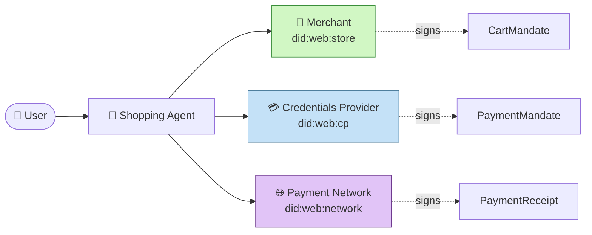
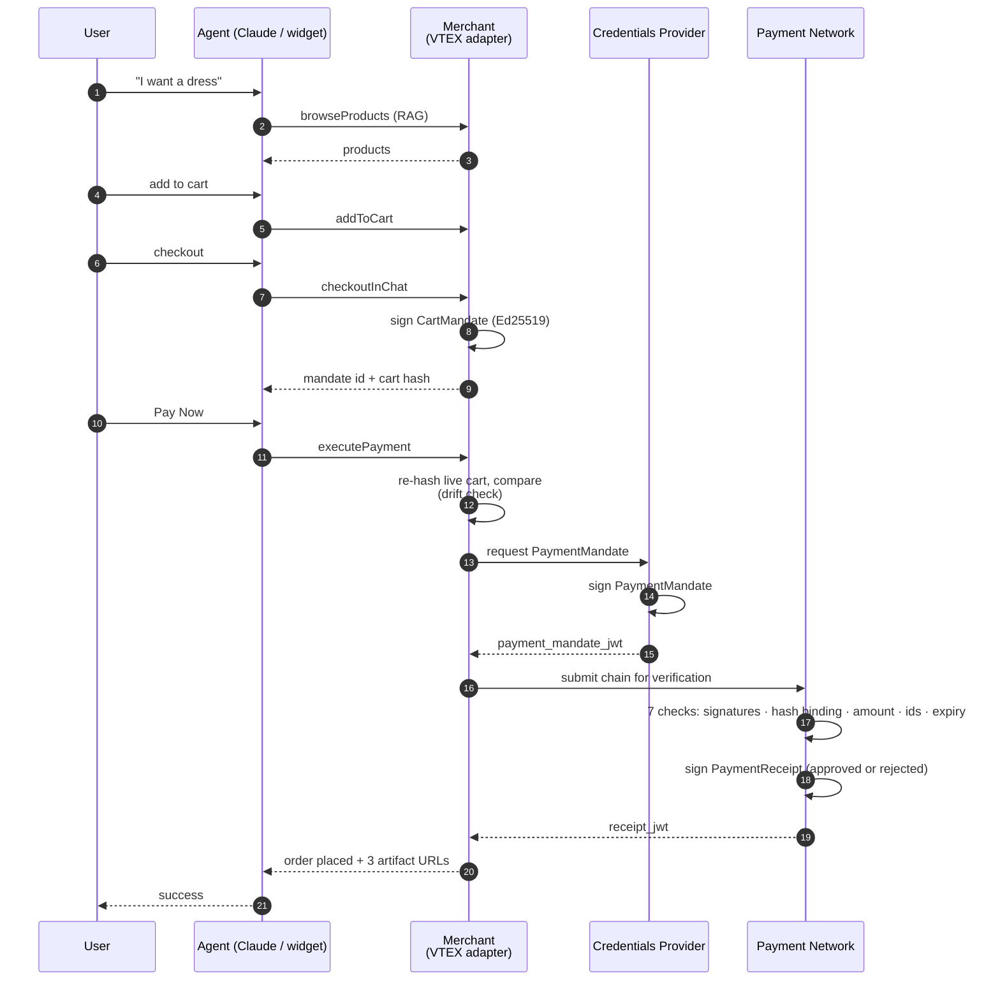
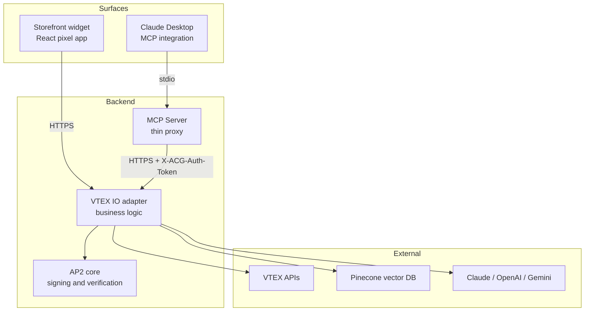

# Agent Commerce Gateway

**An implementation of Google's [Agent Payments Protocol (AP2)](https://github.com/google/AP2) on top of [VTEX IO](https://developers.vtex.com/docs/guides/vtex-io).**
Signed, verifiable, open-source.

[](LICENSE)
[](docs/ap2-specification-v0.1.md)
[](#testing)

---

## TL;DR

When an AI agent buys something on your behalf, **who is responsible if it goes wrong?** Today the answer is "nobody you can prove anything against." AP2 fixes that: three parties (merchant, credentials provider, payment network) each sign a different part of the transaction with their own keys. The whole chain is independently verifiable from public DID documents — no SDK, no shared trust.

This repository is a working AP2 implementation running on a real VTEX storefront, with two front-ends — a Claude Desktop MCP integration and a storefront chat widget — sharing one backend.

> **See it run:** [case study](https://portfolio.ionelmerca.com/case-study/agent-commerce)

---

## The trust gap

Agent commerce sits in a blind spot. The merchant sees an HTTP request — it doesn't see the user. The bank sees a card charge — it doesn't see the agent. The agent sees a checkout flow — it doesn't know what the network will accept.

When something goes wrong (wrong item, drift between displayed price and charged price, fraud, dispute) every party can plausibly point at the others. There's no cryptographic record of who consented to what.

AP2 solves this by making the **mandate** the unit of authority. Three short signed documents — one per party — bind the transaction to specific cryptographic identities at specific moments in time. Anyone can verify the chain afterwards with nothing but the published public keys.

---

## Two modes — same primitives

| Mode | When | Authority | Artifact |
|---|---|---|---|
| **Human-present** | You chat with the agent live and confirm each step. | The user authorises the cart at checkout. | `CartMandate` |
| **Human-not-present** | You pre-delegate. *"Buy these shoes when they drop below 80 RON."* | The user authorises an intent ahead of time. | `IntentMandate` |

This release ships **human-present**. IntentMandate is on the roadmap — same cryptographic shape, different lifecycle.

---

## Three actors. Three keys. Three signed artifacts.



| Party | Signs | What it commits to | In production |
|---|---|---|---|
| **Merchant** | `CartMandate` | "We will sell these items at this price." | The VTEX storefront — `did:web:acg--miniprix.myvtex.com` |
| **Credentials Provider** | `PaymentMandate` | "The user authorised this charge with our credentials." | Stripe · Adyen · PayPal · Apple Pay · Google Pay |
| **Payment Network** | `PaymentReceipt` | "We verified the chain. Decision: approved / rejected." | Visa · Mastercard |

Each party holds its **own** Ed25519 private key. None can sign on another's behalf. Anyone can fetch all three public keys from `/.well-known/did.json` URLs and verify the JWTs.

---

## The cryptographic shape

Every mandate follows the same recipe — borrowed straight from the AP2 v0.2 spec:

```
mandate contents (JSON)
        │
        ▼  JCS canonicalisation  (RFC 8785)
        │
        ▼  SHA-256
        │
        ▼  Ed25519 sign  (signer's private key)
        │
        ▼
   compact JWS  (header.payload.signature)
        │
        ▼
   bundle:  { contents, signed_at, signature_jws, signed_by_did }
```

Verifying reverses the chain: fetch the signer's `did:web` document, extract the public key, verify the JWS over the JCS canonicalisation of the contents. **No SDK. No third-party service.** The verifier needs three URLs and `jose`.

> Why JCS? Because `{"a":1,"b":2}` and `{"b":2,"a":1}` are semantically identical but byte-different. JCS (RFC 8785) is the spec-mandated canonical form so the hash is reproducible across implementations.

---

## End-to-end flow



Every step in the flow is a cryptographic step the verifier can independently replay.

---

## The always-emit invariant

This is the punchline of AP2.

**Even when payment is rejected, the network signs the rejection.**

```json5
{
  "approval_status": "rejected",
  "verification_checks": {
    "merchant_signature_valid": true,
    "cp_signature_valid": true,
    "hash_binding_valid": true,
    "amount_consistent": true,
    "mandate_ids_link": true,
    "cart_mandate_not_expired": true,
    "payment_mandate_not_expired": false   // this is why it failed
  },
  "verification": { "valid": true }        // the receipt itself is valid
}
```

Today a decline is a string the merchant displays to the user. Tomorrow it is **evidence** — a signed artifact every party can replay. Disputes, chargebacks, fraud investigations: all become tractable when the failure mode itself is on-chain.

---

## Two front-ends. One backend.



Both surfaces hit the same VTEX IO routes under `/_v/acg/*`. The MCP server is a thin stdio-to-HTTPS proxy with **no business logic** — every tool resolves to one adapter call. Production swap-in for a third surface (ChatGPT, autonomous agents, UCP) is one new transport, zero changes to the engine.

---

## RAG over a live catalog

Search through a 10k-product VTEX catalog by natural language — *"I want a shirt and some pants for men"* matches `pantaloni` and `cămașă` regardless of language. The pipeline splits into:

| Phase | Where | Why |
|---|---|---|
| **Bulk sync** | `scripts/sync-catalog/` (standalone Node) | VTEX IO has a 30s request timeout — embedding 10k products takes longer. Resume-safe, batched, costs about $0.03 for 10k @ 150 tokens. |
| **Incremental** | adapter, on catalog-change events | Single-product upserts stay inside the 30s budget. |
| **Search-time** | `node/handlers/rag.ts` | OpenAI embeddings (`text-embedding-3-small`, 512 dim) → Pinecone cosine → score ≥ 0.3 → hydrate with live VTEX prices/inventory. |

The vector store is the **discovery layer**; the truth about price and availability always comes from VTEX at query time. No stale prices, no phantom stock.

---

## Backend-agnostic by design

VTEX is the showcase, not the constraint. Three small interfaces in `packages/core` form the seam:

| Interface | Bridges to |
|---|---|
| `CartProvider` | VTEX OrderForm · Shopify Storefront API · BigCommerce · any headless |
| `CatalogProvider` | VTEX Catalog · Shopify · custom CMS · any product source |
| `KeyStore` | VBase (current) · AWS KMS · HashiCorp Vault · HSM |

Swap one class, keep the rest. The mock CP and mock Network in `packages/acg-mock-payment-network` show the exact shape a real Stripe/Visa adapter would conform to.

---

## Security model

This isn't a research toy — it's an internet-facing endpoint backed by real VTEX APIs. Four layers of hardening:

| Layer | Mechanism |
|---|---|
| **Origin allowlist** | `acgAllowedOrigins` in app settings. Browser callers must match. Fail-closed on empty list. |
| **Shared secret** | `acgAuthToken` for the MCP path (no Origin header). 32+ char random string. |
| **Per-IP rate limits** | `acgRateLimits.{chat,mutating,read}.{perMinute,perDay}`. Defaults: chat 20/200, mutating 30/500, read 60/2000. |
| **Per-session cost cap** | `acgSessionDailyLimit` orderForm-scoped daily cap (default 100) to catch runaway sessions from allowlisted origins. |

Mandate verification routes (`/mandates/:id`, `/payment-mandates/:id`, `/receipts/:id`, `/.well-known/did.json`) are deliberately unauthenticated — they're the public verification surface. They use the read-class rate limit.

---

## What's real, what's mocked

| Real | Mocked |
|---|---|
| Ed25519 signatures (RFC 8032 via `jose`) | Credentials Provider (signs with its own demo key — same shape as Stripe / Adyen) |
| JCS canonicalisation (RFC 8785) | Payment Network (signs with its own demo key — same shape as Visa / Mastercard) |
| `did:web` resolution + public keys at `.well-known/did.json` | Card tokenisation (no PCI flow in the demo) |
| JWT JWS bundles with `EdDSA` alg | 3DS2 step-up (force-reject simulates it) |
| Verification: 7 checks across signatures, hash binding, amount, ids, expiry | |
| Drift detection on cart between sign and pay | |
| The full chain published at `.well-known/did.json` URLs | |

The cryptographic shape is **production-grade and spec-faithful**. The mocked actors exist so the demo can run end-to-end without onboarding a real PSP. Each is one class change away from production.

---

## Repository layout

```
.
├── packages/
│   ├── shared/                          @acg/shared — cross-process types
│   ├── core/                            @acg/core — AP2 primitives (JCS, Ed25519, mandates)
│   ├── mcp-server/                      stdio MCP proxy for Claude Desktop
│   ├── acg-mock-payment-network/        mock CP + mock Payment Network (demo)
│   └── vtex-io-adapter/                 VTEX IO Node service — ALL business logic
│       ├── manifest.json                policies, app settings schema, vendor
│       ├── node/service.json            route declarations
│       └── node/
│           ├── handlers/                chat, cart, checkout, search, mandates
│           ├── clients/                 LLM, Pinecone, VTEX
│           ├── core/                    vendored @acg/core (VTEX IO can't reach file: deps)
│           └── config/profiles/         per-merchant profile (system prompt, brand strings)
├── apps/
│   └── acg-chat-widget/                 React pixel app for storefront embed
├── scripts/
│   ├── sync-catalog/                    standalone bulk RAG sync (VTEX → embeddings → Pinecone)
│   ├── sync-types.sh                    syncs shared types into the adapter (auto-runs on vtex link)
│   └── test-rag-pipeline.mjs            end-to-end RAG smoke test
├── docs/
│   ├── ARCHITECTURE.md                  full 4-layer config-driven design
│   ├── AP2_COMPLIANCE.md                what's spec-compliant vs simplified
│   ├── SETUP.md                         local setup + Claude Desktop wiring
│   ├── ap2-specification-v0.1.md        the spec this implements
│   └── archive/                         earlier planning docs (kept for context)
└── LICENSE                              Apache 2.0
```

---

## Quick start

Prerequisites: Node 18+, a VTEX account, API keys for OpenAI + Pinecone (and Claude or Gemini if you want them).

```bash
# 1. Clone + install
git clone https://github.com/exilonX/ap2.git
cd ap2
npm install

# 2. Generate shared types into the adapter
npm run sync-types

# 3. Build the MCP server (for Claude Desktop)
npm run build:mcp

# 4. Set up VTEX
cd packages/vtex-io-adapter
vtex login YOUR-ACCOUNT
vtex use YOUR-WORKSPACE
vtex link

# 5. Configure app settings (LLM keys, Pinecone, allowed origins)
# Either via VTEX Admin > Apps > ACG Adapter > Settings
# or with `vtex apps settings` from the CLI
```

Full setup walkthrough including Claude Desktop config and the RAG bulk sync: [`docs/SETUP.md`](docs/SETUP.md).

---

## Testing

```bash
# AP2 cryptographic primitives — 68 tests
cd packages/core && npm test

# VTEX IO adapter — 49 tests
cd packages/vtex-io-adapter && yarn test

# End-to-end RAG pipeline smoke test (requires env vars)
node scripts/test-rag-pipeline.mjs
```

The 117 tests cover JCS canonicalisation, Ed25519 keypair generation and verification, mandate signing and bundle construction, DID document resolution, cart compression, the auth middleware (origin allowlist + shared secret), rate limiting, the force-reject path, and mandate orchestration.

Out of scope today: the LLM chat loop in `node/handlers/chat.ts` (2k lines) — covered by manual demos, not unit tests. PRs welcome.

---

## Stack

- **Runtime:** Node (VTEX IO `node@7` builder, Node 16 LTS in production)
- **Crypto:** [`jose`](https://github.com/panva/jose) for Ed25519 + JWS · [`canonicalize`](https://github.com/erdtman/canonicalize) for JCS
- **Vector search:** [Pinecone](https://www.pinecone.io/) (cosine, 512-dim)
- **Embeddings:** OpenAI `text-embedding-3-small`
- **Chat:** Anthropic Claude (default) · OpenAI · Google Gemini — provider switch in app settings
- **Storefront widget:** React (TypeScript 3.9.7 — pinned for VTEX `render-runtime`)
- **MCP:** `@modelcontextprotocol/sdk` over stdio

---

## Roadmap

- [x] **v0.0.x** Human-present AP2 ceremony (CartMandate · PaymentMandate · PaymentReceipt)
- [x] MCP + storefront-widget surfaces sharing one backend
- [x] Force-reject + always-emit-signed-rejection demo
- [ ] **v0.1** IntentMandate (human-not-present)
- [ ] Production CP swap-in (Stripe / Adyen)
- [ ] Production Network swap-in (Visa / Mastercard via real card-network simulators)
- [ ] ChatGPT / UCP transport in front of the same adapter
- [ ] Multi-tenant profile management UI

See [`docs/archive/ROADMAP.md`](docs/archive/ROADMAP.md) for the longer-term phases.

---

## Documentation

- [`docs/ARCHITECTURE.md`](docs/ARCHITECTURE.md) — the four-layer config-driven design
- [`docs/AP2_COMPLIANCE.md`](docs/AP2_COMPLIANCE.md) — spec-compliance matrix and known deviations
- [`docs/SETUP.md`](docs/SETUP.md) — local setup + Claude Desktop wiring
- [`docs/ap2-specification-v0.1.md`](docs/ap2-specification-v0.1.md) — the spec this implements
- [`CONTEXT.md`](CONTEXT.md) — domain glossary
- [`CLAUDE.md`](CLAUDE.md) — repository guide for AI assistants
- [`docs/archive/`](docs/archive/) — earlier planning docs, video script, showcase plan (historical context)

---

## Credits & contact

Built by **Ionel Merca** as a working proof of agent commerce on VTEX.

- 📩 [ionel.merca@gmail.com](mailto:ionel.merca@gmail.com) — book a call to deploy this on your store
- 🌐 [portfolio.ionelmerca.com/case-study/agent-commerce](https://portfolio.ionelmerca.com/case-study/agent-commerce) — full case study
- 🐙 [github.com/exilonX/ap2](https://github.com/exilonX/ap2) — source

This implementation tracks the **public** [AP2 specification](https://github.com/google/AP2) published by Google. Mandate field names, signing algorithms, and DID resolution follow v0.2 of that spec.

---

## License

Apache License 2.0. See [`LICENSE`](LICENSE).
